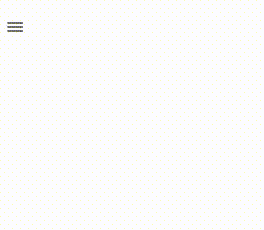

## install

npm i vue-list-item-menu

## use

```html
<dropdown-menu :id="'menu' + id">
    <dropdown-menu-item :default="true" title="Просмотр" class="show" @click="menuShow()"></dropdown-menu-item>
    <dropdown-menu-item title="Редактирование" class="edit" @click="menuEdit()"></dropdown-menu-item>
    <dropdown-menu-sep></dropdown-menu-sep>
    <dropdown-menu-item title="Удалить" class="del" @click="menuDelete()"></dropdown-menu-item>
</dropdown-menu>
```

example app

```js
import dropdownMenu from 'vue-list-item-menu'
Vue.use(dropdownMenu)
```

## screenshot


### dropdown-menu-item properties
| Name   | Type  | Required | Default | Description |
| ------ |:-----:| :---------:| --------|:---------|
| title | String | true  |        | menu item title |
| default | Boolean | false  | false | set default class for item |

### dropdown-menu-item events
| Name   | params | Description |
| ------ |:-----:|:---------|
| click |   |  |
